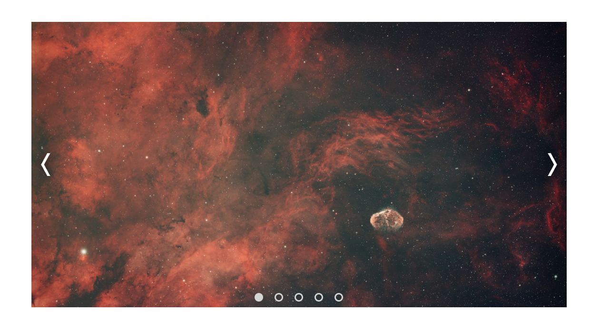

# carousel-showcase-top

My carousel showcase, made for [The Odin Project](https://www.theodinproject.com/).

## Live Preview

See a [live preview](https://jacobsmithdev.github.io/carousel-showcase-top/).

## Tools used:

- HTML
- CSS
- Javascript
- [NPM](https://www.npmjs.com/)
- [Webpack](https://webpack.js.org/)

## References

- [The Odin Project](https://www.theodinproject.com/)
- [Lesson Page](https://www.theodinproject.com/lessons/node-path-javascript-dynamic-user-interface-interactions)
- [BEM: CSS naming convention](https://getbem.com/introduction/)
- [Conventional Commits: Git commit convention](https://www.conventionalcommits.org/en/v1.0.0/)
